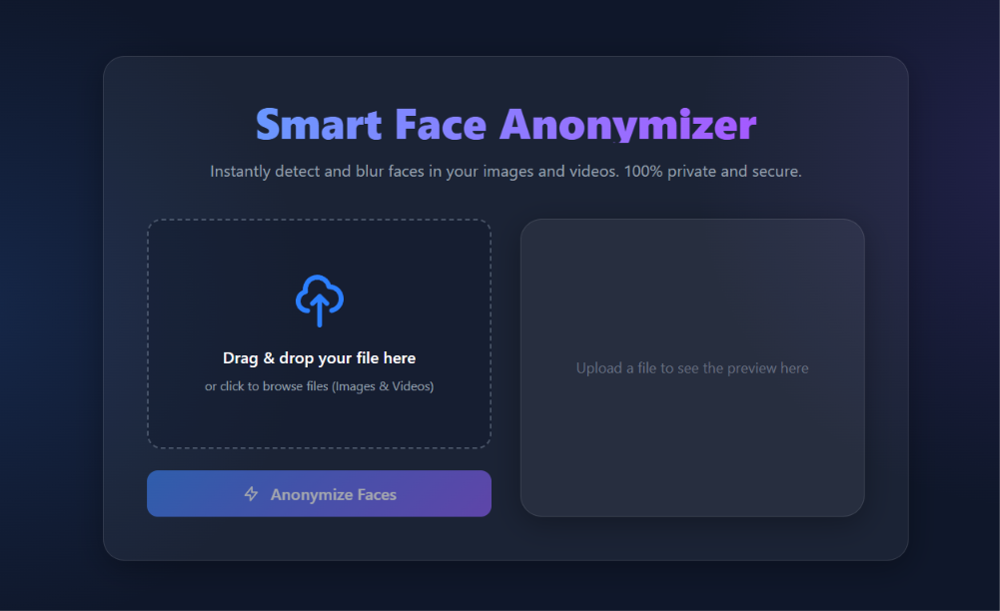

# 🎭 Smart Face Anonymizer

A privacy-focused AI-powered web application that automatically detects and anonymizes faces in images and videos using **OpenCV**, **Flask**, and **Next.js**.

<p align="center">
  
</p>

<p align="center">
  
  
  
  
</p>

---

## ✨ Features

* 🖼️ Face anonymization in images
* 🎥 Face anonymization in videos
* 🤖 Automatic face detection using OpenCV
* 🌫️ Gaussian blur-based face masking
* ⚡ Fast processing with Flask API
* 📱 Responsive Next.js interface
* 🔒 Privacy-first workflow
* 👀 Instant preview of processed media
* 📥 Download anonymized results

---

## 📸 Demo

Upload an image or video, click **Anonymize Faces**, and receive a privacy-safe version with all detected faces blurred.

---

## 🏗️ Tech Stack

### Frontend

* Next.js
* React.js
* Tailwind CSS
* JavaScript

### Backend

* Flask
* OpenCV (cv2)
* NumPy
* Flask-CORS

### Computer Vision

* Haar Cascade Face Detection
* Gaussian Blur Face Anonymization

---

## 📂 Project Structure

```bash
Smart-Face-Anonymizer/
│
├── app/                         # Next.js App Router
│
├── public/                      # Static assets
│
├── assets/
│   └── smart-face-anonymizer-ui.png
│
├── python-backend/
│   ├── models/                  # Face detection models
│   ├── outputs/                 # Processed files
│   ├── uploads/                 # Uploaded files
│   ├── venv/
│   ├── app.py                   # Flask API
│   ├── fix_icon.py
│   ├── remove_bg.py
│   └── requirements.txt
│
├── .env.local
├── .gitignore
├── eslint.config.mjs
├── jsconfig.json
├── next.config.mjs
├── package.json
├── package-lock.json
├── postcss.config.mjs
└── README.md
```

---

## ⚙️ Architecture

```text
┌────────────────────┐
│   Next.js Client   │
└─────────┬──────────┘
          │
          ▼
┌────────────────────┐
│     Flask API      │
└─────────┬──────────┘
          │
          ▼
┌────────────────────┐
│ OpenCV Face Detect │
│   & Blur Engine    │
└─────────┬──────────┘
          │
          ▼
┌────────────────────┐
│ Anonymized Output  │
└────────────────────┘
```

---

## 🚀 Getting Started

### 1. Clone the Repository

```bash
git clone https://github.com/Himanshu-soni3185/Smart-Face-Anonymizer.git

cd Smart-Face-Anonymizer
```

### 2. Install Dependencies

```bash
npm install
```

### 3. Start the Next.js Frontend

```bash
npm run dev
```

Frontend runs at:

```text
http://localhost:3000
```

### 4. Start the Flask Backend

Open a new terminal and run:

```bash
npm run api
```

Backend runs at:

```text
http://localhost:5000
```

---

## 📦 Backend Requirements

```txt
Flask==3.0.0
Werkzeug==3.0.1
Flask-Cors==4.0.0
numpy==1.26.4
opencv-python-headless==4.10.0.84
```

---

## 🔌 API Endpoints

### Anonymize Image

```http
POST /anonymize-image
```

**Request**

```form-data
file: image.jpg
```

---

### Anonymize Video

```http
POST /anonymize-video
```

**Request**

```form-data
file: video.mp4
```

---

## 🖼️ Supported Formats

### Images

* JPG
* JPEG
* PNG
* WEBP

### Videos

* MP4
* AVI
* MOV
* MKV

---

## 🔒 Privacy

Smart Face Anonymizer is designed with privacy in mind:

* Files are processed locally by the backend.
* No permanent storage of uploaded files.
* Faces are automatically anonymized before download.
* Suitable for privacy-sensitive media sharing.

---

## 🎯 Use Cases

* Social Media Content Creation
* Privacy Protection
* Research Datasets
* CCTV Footage Processing
* Educational Projects
* Journalism & News Media
* Computer Vision Demonstrations

---

## ⭐ Support

If you found this project useful:

* ⭐ Star the repository
* 🍴 Fork the project
* 🚀 Share it with others

---

## 👨‍💻 Author

**Himanshu Soni**

GitHub Repository:

https://github.com/Himanshu-soni3185/Smart-Face-Anonymizer

---

## 📜 License

This project is licensed under the MIT License.

---

<p align="center">
  <b>🎭 Protect Privacy with AI-Powered Face Anonymization</b>
</p>
